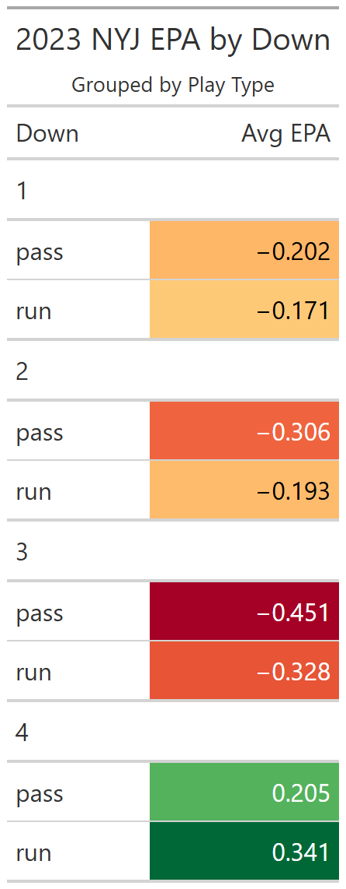

## Projects

### ✅ 2023 New York Jets Offensive Analysis
Investigated Jets run rate inefficiency by down 
compared to league average.

Key finding: Jets ran below league average on 1st 
and 2nd down but above league average on 3rd down.

  

---

### 🔄 NFL 4th Down Decision Analysis (In Progress)
### 📋 QB 3rd Down Efficiency Model (Upcoming)
### 📋 College Recruiting Efficiency Model (Upcoming)
### 📋 Transfer Portal Analytics (Upcoming)
