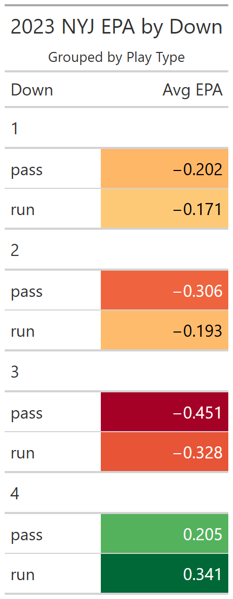
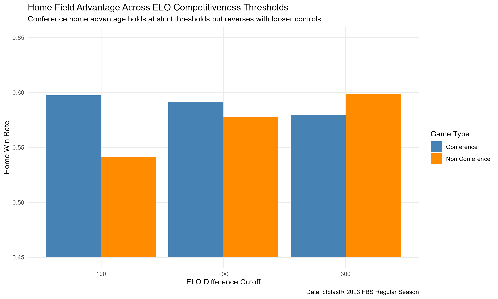

## Projects

### ✅ 2023 New York Jets Offensive Analysis
Investigated Jets run rate inefficiency by down 
compared to league average.

Key finding: Jets ran below league average on 1st 
and 2nd down but above league average on 3rd down.

Tools: R, nflfastR, tidyverse, ggplot2
<div align="center">
  
</div>

---
### 🏈 Home Field Advantage - Three Stage ELO Analysis
**Research Question:** Is home field advantage stronger in Conference or Non-Conference games?
**Method:** Three-stage analysis controlling for game competitiveness using pregame ELO rating differences.

**Findings:**
- Raw data: Non-Conference home win rate (.646) ⬆️ than Conference (.536) - but contaminated by cupcake  scheduling
- ELO controlled at < 100 points difference: Conference (.597) ⬆️ than Non-Conference (.542)
- ELO controlled at < 200 points difference: Conference (.592) ⬆️ than Non-Conference (.578)
- ELO controlled at < 300 points difference: Conference (.582) ⬇️ than Non-Conference (.599) talent mismatches re-enter sample.
  
<div align="center">
  
</div>
**Conclusion:** 
True home field advantage is marginally stronger in conference play when controlling for talent mismatch. 
This could be due to larger crowds for more heated rivalries, that effect the away teams more. Also, cumulative conference road travel fatigue could be decreasing the away teams performance since conference games generally are being played in the middle to end of a teams schedule. That being said:

**DON'T BE AFRAID TO SCHEDULE CHALLENGING NON-CONFERENCE OPPONENTS!!!**

Tools: R, cfbfastR, tidyverse, ggplot2


## Does Returning Production Predict Offensive Improvement? 

**Question:** Do college football offenses that bring back more of last year's production actually get better the next season?

Returning production is one of the most-cited preseason stats in college football. This project tests whether it predicts offensive improvement from 2024 to 2025 once you account for how good each offense already was.

### Key Findings

- **Returning production did not predict offensive improvement.** After controlling for 2024 performance, its effect on 2025 EPA/play was small and not statistically significant (coefficient = -0.015, p = 0.65).
- **Last year's performance was a weak guide.** Only about 28% of an offense's above- or below-average EPA/play in 2024 carried into 2025, which shows strong regression to the mean.
- **Teams that lost the most production improved slightly more than teams that kept the most.**

| Group | Teams that improved | Avg EPA/play change | Median change |
|---|---|---|---|
| Top 10 in returning production | 7 of 10 | +0.036 | +0.024 |
| Bottom 10 in returning production | 7 of 10 | +0.054 | +0.064 |

### Data

- **Play-by-play:** 2024 and 2025 FBS seasons via [cfbfastR](https://cfbfastr.sportsdataverse.org/) (`load_cfb_pbp()`)
- **Returning production:** 2025 offensive returning production via `cfbd_player_returning()`, sourced from [CollegeFootballData.com](https://collegefootballdata.com/)

### Method

1. Calculated offensive EPA/play for each team in 2024 and 2025 using run and pass plays only, excluding plays with missing EPA.
2. Kept offenses with at least 300 plays in both seasons, leaving **134 teams**.
3. Joined each team's 2025 returning production (share of 2024 offensive production that returned).
4. Compared the highest- and lowest-returning teams.
5. Fit a linear regression to separate the effect of returning production from regression to the mean:

```r
lm(epa_2025 ~ epa_2024 + off_returning, data = analysis)
```

| Term | Estimate | Std. Error | p-value |
|---|---|---|---|
| Intercept | 0.026 | 0.015 | 0.078 |
| 2024 EPA/play | 0.284 | 0.077 | < 0.001 |
| Returning production | -0.015 | 0.033 | 0.648 |

R² = 0.094 (n = 134)

### Interpretation

Once you account for how good an offense was the year before, knowing how much production it returned did not help predict next season's performance. The model explains only about 9% of the variation in 2025 offense, so most year-to-year change comes from factors not captured here, such as coaching changes, incoming transfers, quarterback play, and schedule.

The result does not prove returning production has *zero* effect. The 95% confidence interval (about -0.08 to +0.05) rules out a large positive effect, but not a small one.

### Limitations

- **One season pair.** A single year can be noisy, so results may differ in other seasons.
- **Incoming transfers are not counted.** Returning production measures who stayed, not who arrived. In the transfer portal era, a team can lose most of its production and still improve by replacing it.
- **Offense only.** Defensive returning production was not tested.

### Tools

R, tidyverse, cfbfastR

### 🔄 NFL 4th Down Decision Analysis (In Progress)
### 📋 QB 3rd Down Efficiency Model (Upcoming)
### 📋 College Recruiting Efficiency Model (Upcoming)
### 📋 Transfer Portal Analytics (Upcoming)
